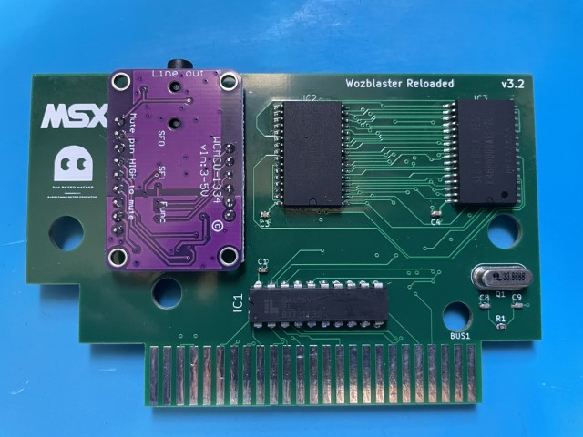
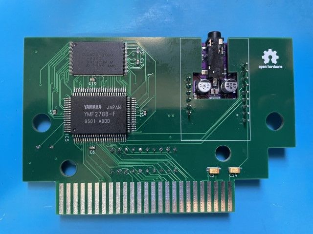

# The Wozblaster (Reloaded)

The WozBlaster OPL4 cartridge is a sound expansion device designed for the MSX platform. This cartridge enables a range of additional audio capabilities for the MSX, including support for both FM synthesis and wavetable synthesis. 

At its core is the OPL4 (FM Operator Type-L4) sound chip, which was developed by Yamaha and used in a variety of electronic musical instruments and computer sound cards. 

With the WozBlaster OPL4 cartridge, MSX computer users can enjoy high-quality sound and create complex musical arrangements with ease.

.jpg)

The WozBlaster cartridge is an external sound device designed for the MSX platform. It is a clone of the Moonsound and allows access to the advanced capabilities of the OPL4 sound chip for MSX games and other OPL4-compatible music software. The cartridge was originally designed by Gustavo Iriarte.

The OPL4 sound chip from Yamaha is typically paired with a YAC513 floating-point DAC chip, or an alternative compatible DAC chip. The YMF278 is an enhanced version of the OPL3 and, although not officially part of the standard, has been widely adopted by the MSX community, particularly in Europe.

Moonsound clones generally come equipped with 1 MB of sample-RAM and a 2 MB Yamaha YRW801-M General MIDI ROM. Although the board has the capacity to address more than 1 MB of memory, the original version of the Wozblaster only had two 512K memory chips.

It's worth noting that the original Wozblaster PCB cannot be fitted into a traditional MSX cartridge case. Additionally, as detailed in the building instructions, the audio jack holes on the original board are quite small, which made it difficult to find a connector that would fit.

Image below shows the original Wozblaster cartridge PCB:

|PCB Side 1|PCB Side 2|
|---|---|
|.jpg)|.jpg)|

A few reloaded versions of the WozBlaster cartridge have been created with appropriately-sized holes to fit both Konami and Patola cartridge cases. Additionally, the audio jack holes have been enlarged to accommodate most common audio jack connectors. Some versions of the cartridge are still a work in progress.

Currently, the following versions of the WozBlaster cartridge are available (please note that this list is subject to change as new versions become available):

* [Wozblaster Reloaded v1.1](/hardware/reloaded_v1.1) - Based on the original circuit, this version features a combination of through-hole and surface-mount components. The board is smaller and can fit in both Konami and Patola cases. (tested and working)

|PCB Side 1|PCB Side 2|
|---|---|
|.jpg)|.jpg)|

* [Wozblaster Reloaded v1.3](/hardware/reloaded_v1.3) - This version replaces the old 27C160 EPROM with an AM29F016B flash memory, and all passive components are 0603 SMD. The sound is injected back to SOUNDIN in mono. The board is smaller and can fit in both Konami and Patola cases. (abandoned)
  
* [Wozblaster Reloaded v3.3](/hardware/reloaded_v3.3/) - Version based on the UDA1334 DAC, and using the [Adafruit A1334 DAC Module](https://github.com/adafruit/Adafruit-UDA1334A-I2S-Stereo-DAC-PCB) to perform the digital to analog conversion. It is injecting audio back into the SOUNDIN MSX pin. It features 1MB of RAM and 2MB of ROM with MIDI compatible samples. (tested and working)

|PCB Side 1|PCB Side 2|
|---|---|
|||

* [Wozblaster Reloaded v4.0](/hardware/reloaded_v4.0/) - Evolution of v3.3 featuring a 2MB CY62167ELL RAM integrated. It also mixes the computer SOUNDIN. (tested and working)

|PCB Side 1|PCB Side 2|
|---|---|
|.jpg)|.jpg)|

* [Wozblaster Reloaded v4.5](/hardware/reloaded_v4.5/) - This version is now using the EPM7064STC44 (or EPM7032STC400) CPLD to replace the GAL16V8D it also better isolates the audio channels  before injecting them as mono back to the MSX SOUNDIN. (In development)

# Box and Inlay Trays

The Wozblaster Reloaded has a box designed by Adriano Souza to fit the cartridge. The box is available in the [box](/box) folder.

Although a paper inlay is provided to secure the cartridge inside the box, it is highly recommended to use a plastic insert inner tray (bed) for additional protection, especially during transportation. These trays can be purchased from AliExpress at the following link: [AliExpress Tray](https://s.click.aliexpress.com/e/_DDVBv2D).

# Resources

This GitHub repository contains all of the resources needed to build both the original WozBlaster cartridge and the reloaded versions. For detailed instructions, you can refer to the article I wrote, which includes an updated bill of materials (BOM) with links to purchase the required components. You can find the article at https://theretrohacker.com/2022/12/31/blasting-sound-for-your-msx-the-wozblaster-reloaded/.

The update on the v3.1 development has been posted on a short YouTube video in english [here](https://youtu.be/J95RrFSF2NM). 

The update on v3.2 is available on a quick video [here](https://www.youtube.com/shorts/V5VmL33uvzE). 

Each folder contains detailed Bill of Materials for each version of the board, as well as the Gerber files needed to manufacture the PCBs. 

## License 

This work is licensed under a [Creative Commons Attribution-NonCommercial-ShareAlike 4.0 International License](http://creativecommons.org/licenses/by-nc-sa/4.0/).

* If you remix, transform, or build upon the material, you must distribute your contributions under the same license as the original.
* You may not use the material for commercial purposes.
* You must give appropriate credit, provide a link to the license, and indicate if changes were made. You may do so in any reasonable manner, but not in any way that suggests the licensor endorses you or your use.

**ATTENTION**

This project was made for the retro community and not for commercial purposes. So only retro hardware forums and individual people can build this project.

THE SALE OF ANY PART OF THIS PROJECT WITHOUT EXPRESS AUTHORIZATION IS PROHIBITED!